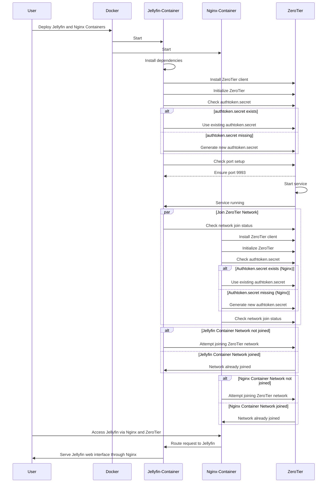

# Jellyfin with ZeroTier and Nginx Docker Setup

This project provides a Docker setup for running Jellyfin, a media server, with networking handled by ZeroTier for secure and seamless remote access. Nginx is included in the setup for reverse proxy and SSL support. This setup ensures that you do not need to expose any ports directly to the internet.

## Background

When running applications like Jellyfin in Docker containers, a common challenge is mapping network ports from the container to the host. This is necessary for accessing services externally. However, exposing these ports directly to the internet can pose security risks and configuration challenges:

- **Security Concerns**: Open ports on your system can be exploited by malicious actors, leading to potential unauthorized access.
- **Network Complexities**: Managing port mappings, especially when running multiple services, can become complex and error-prone.
- **Dynamic Networks**: When operating within dynamic network environments (e.g., cloud or shared networks), consistent access via fixed IPs and open ports can be difficult to maintain.

To address these issues, this project utilizes ZeroTier and Nginx:

- **ZeroTier**: Provides secure networking with encrypted traffic reducing security risks associated with port exposure.
- **Nginx**: Acts as a reverse proxy and facilitates SSL termination for secure access over HTTPS.

## Prerequisites

- Docker and Docker Compose installed on your machine
- A ZeroTier account and network

## Setup Instructions

1. **Clone the Repository**

   Clone this repository to your local machine.

   ```bash
   git clone https://github.com/yourusername/jellyfin-zerotier-setup.git
   cd jellyfin-zerotier-setup
   ```

2. **Configure Environment**

   Replace placeholders in the `docker-compose.yml` file with your paths and network ID:
   
   - Jellyfin:
     - Replace `REPLACE_WITH_YOUR_CONFIG_PATH` with your Jellyfin config path.
     - Replace `REPLACE_WITH_YOUR_CACHE_PATH` with your Jellyfin cache path.
     - Replace `REPLACE_WITH_YOUR_MEDIA_PATH` with your media files path.
     - Replace `REPLACE_WITH_YOUR_ZEROTIER_PATH` with your ZeroTier data path.
   - Nginx:
     - Replace `REPLACE_WITH_YOUR_NGINX_CONF` with your Nginx configuration file path.
     - Replace `REPLACE_WITH_YOUR_NGINX_SSL` with your path to SSL certificates.
   - General:
     - Replace `REPLACE_WITH_NETWORK_ID` with your ZeroTier network ID.

3. **Build and Deploy the Containers**

   Run the following command to build and start the containers:

   ```bash
   docker-compose up --build -d
   ```

   The Jellyfin and Nginx services will start automatically and join the configured ZeroTier network.

4. **Access Jellyfin**

   Use ZeroTier networking to access Jellyfin:

   - Find the Jellyfin instance's IP in the ZeroTier network.
   - Access via Nginx using HTTPS with the following URL: `https://<Nginx_IP>`.

## Customization

- **PUID and PGID**: Update these environment variables in the `docker-compose.yml` to match your local user and group IDs for proper file permissions.
  
- **Ports**: Ports are handled by ZeroTier. Ensure your client machine is also connected to the same ZeroTier network.

## ZeroTier Network

Ensure that your machine is also part of the ZeroTier network. Use the ZeroTier One client to join the same network with the ID specified in the `docker-compose.yml`.

## Troubleshooting

- **Container Logs**: Check the logs of the Jellyfin or Nginx container using:

  ```bash
  docker logs jellyfin-other
  ```

  ```bash
  docker logs nginx-jellyfin-other
  ```

- **ZeroTier Connection**: Verify that the containers have successfully joined the ZeroTier network:

  ```bash
  docker exec jellyfin-other zerotier-cli listnetworks
  docker exec nginx-jellyfin-other zerotier-cli listnetworks
  ```

## Contributing

Feel free to open an issue or submit a pull request with improvements or fixes. For major changes, please open an issue first to discuss what you'd like to change.

---

This setup is a starting point and may require further configuration based on your media setup and network needs.
```

### Explanation:
- **Introduction and Background**: Updated to reflect the inclusion of Nginx and its role in the setup.
- **Prerequisites**: Lists the required software and accounts.
- **Setup Instructions**: Provides step-by-step instructions for setting up the environment, building, and deploying the container.
- **Access Instructions**: Updated for accessing Jellyfin through the Nginx proxy with HTTPS.
- **Build and Deploy Instructions**: Now encompass the deployment of multiple containers including Nginx.
- **Customization**: Explains how to modify environment variables.
- **ZeroTier Network**: Highlights the significance of being part of the same ZeroTier network.
- **Troubleshooting**: Includes commands for Nginx container logs and network checks.
- **Contributing**: Details on how others can contribute to the project.

```
Make sure to adjust the repository URL and any specific paths or placeholders according to your actual setup and preferences.Make sure to adjust the repository URL and any specific instructions according to your actual setup and preferences.

## Sequence Diagram :



### Explanation:
1. **Participants**: The diagram identifies the main components involved:
   - **User**: Initiates the deployment and accesses the Jellyfin server.
   - **Docker**: Serves as the platform to deploy and manage the Jellyfin container.
   - **Jellyfin Container**: Hosts the Jellyfin media server and manages its operations.
   - **ZeroTier**: Provides secure virtual networking for seamless and remote access without exposing ports directly to the internet.
   
2. **Flow**: 
   - **Deployment**: The process begins with the user deploying the Jellyfin container using Docker, leveraging Docker’s capabilities to isolate and run the application.
   - **Setup**: Inside the container, necessary dependencies are installed to ensure Jellyfin operates smoothly.
   - **ZeroTier Initialization**: ZeroTier is set up within the Jellyfin container to manage secure networking.
   - **Secure Credential Check**: The setup script checks for the existence of an `authtoken.secret`, a key component for ZeroTier’s authentication.
   - **Authtoken Management**: If the `authtoken.secret` does not exist, it generates a new one to facilitate secure network communications.
   - **Port Configuration**: The setup script ensures that the ZeroTier network port (usually port 9993) is set correctly within the container.
   - **ZeroTier Service Initialization**: The ZeroTier service is started, confirming its active status back to the Jellyfin container.
   - **Network Verification**: The Jellyfin container checks if it has joined the specified ZeroTier network and attempts to join if necessary, ensuring secure and consistent remote access.

3. **User Interactivity**: Finally, the user accesses the Jellyfin web interface via the secure tunnel created by the ZeroTier network, thus providing a seamless entertainment experience without the vulnerabilities of exposed network ports.

This explanation clarifies the essential operations carried out within the sequence diagram, highlighting the technological interactions and security measures associated with running Jellyfin in a Docker container managed through ZeroTier networking.