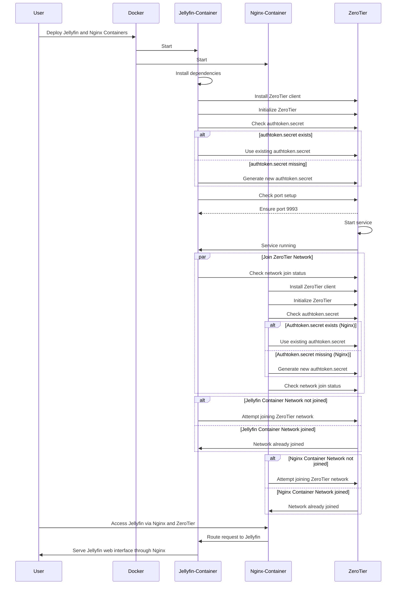

### Explanation:
1. **Participants**: The diagram identifies the main components involved:
   - **User**: Initiates the deployment and accesses the Jellyfin server.
   - **Docker**: Serves as the platform to deploy and manage the Jellyfin container.
   - **Jellyfin Container**: Hosts the Jellyfin media server and manages its operations.
   - **ZeroTier**: Provides secure virtual networking for seamless and remote access without exposing ports directly to the internet.
   
2. **Flow**: 
   - **Deployment**: The process begins with the user deploying the Jellyfin container using Docker, leveraging Docker’s capabilities to isolate and run the application.
   - **Setup**: Inside the container, necessary dependencies are installed to ensure Jellyfin operates smoothly.
   - **ZeroTier Initialization**: ZeroTier is set up within the Jellyfin container to manage secure networking.
   - **Secure Credential Check**: The setup script checks for the existence of an `authtoken.secret`, a key component for ZeroTier’s authentication.
   - **Authtoken Management**: If the `authtoken.secret` does not exist, it generates a new one to facilitate secure network communications.
   - **Port Configuration**: The setup script ensures that the ZeroTier network port (usually port 9993) is set correctly within the container.
   - **ZeroTier Service Initialization**: The ZeroTier service is started, confirming its active status back to the Jellyfin container.
   - **Network Verification**: The Jellyfin container checks if it has joined the specified ZeroTier network and attempts to join if necessary, ensuring secure and consistent remote access.

3. **User Interactivity**: Finally, the user accesses the Jellyfin web interface via the secure tunnel created by the ZeroTier network, thus providing a seamless entertainment experience without the vulnerabilities of exposed network ports.

This explanation clarifies the essential operations carried out within the sequence diagram, highlighting the technological interactions and security measures associated with running Jellyfin in a Docker container managed through ZeroTier networking.