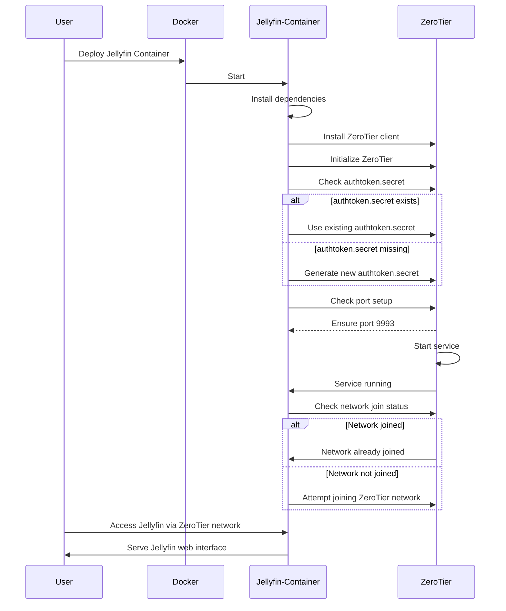

### Explanation:
1. **Participants**: The diagram identifies the main components involved: User, Docker, Jellyfin Container, and ZeroTier.
2. **Flow**: 
   - The process begins with the user deploying the Jellyfin container using Docker.
   - Inside the container, dependencies are installed, and ZeroTier is set up.
   - It checks for the existence of an `authtoken.secret` and generates one if necessary.
   - The setup ensures that the necessary port for ZeroTier is configured.
   - ZeroTier service starts and confirms its running state back to the Jellyfin container.
   - The container checks if it has joined the correct ZeroTier network and attempts to join if it hasn't already.
3. **User Interactivity**: Finally, the user accesses the Jellyfin web interface through the ZeroTier network.

